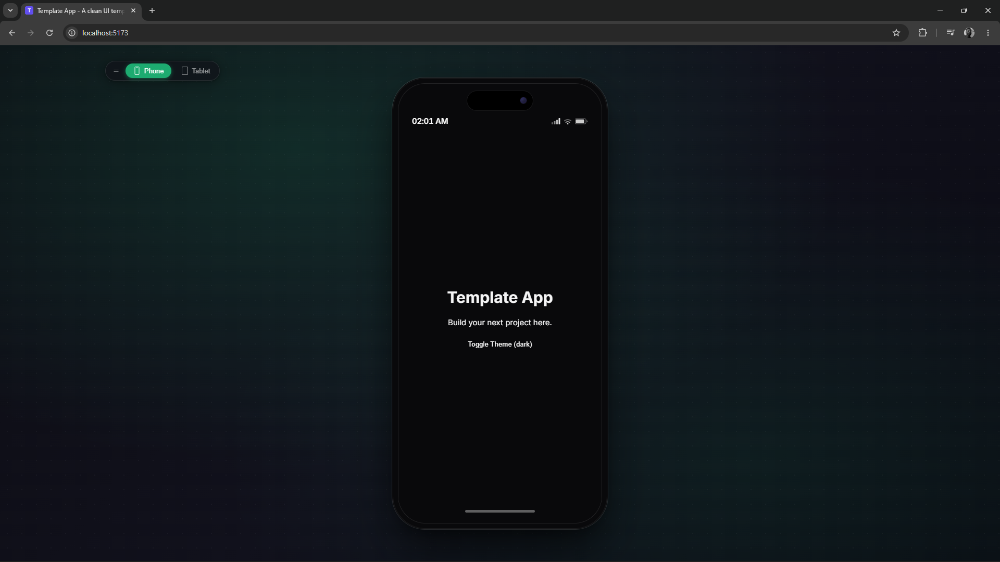
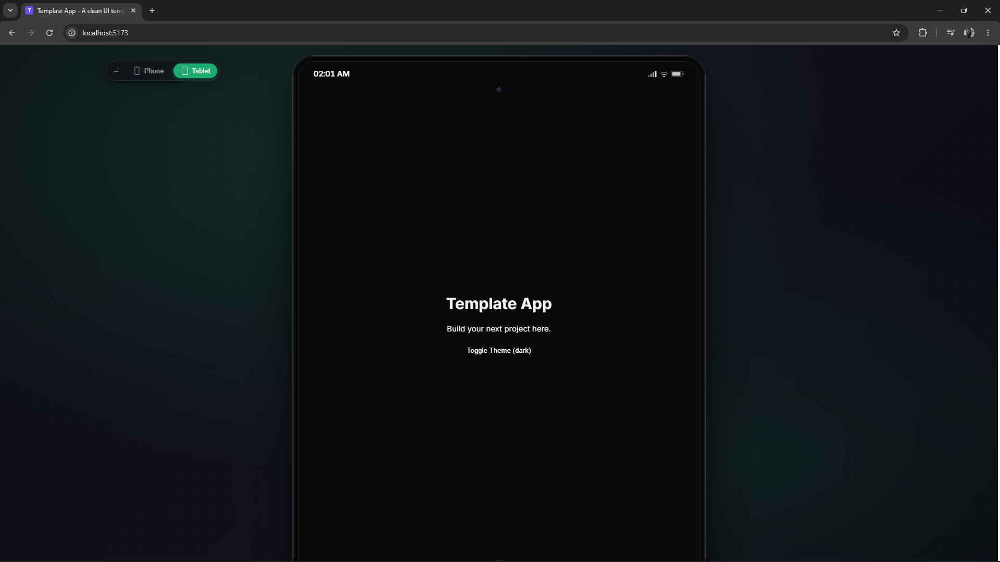

<div align="center">
  <h1>📱 Mobile Frame UI</h1>
  <p><strong>A lightweight, zero-configuration React UI wrapper for simulating and previewing responsive web applications inside interactive device frames.</strong></p>
  <p>
    
    
    
    
  </p>
  <p>
    
    
  </p>
</div>

---

## 🌟 Overview

Developing mobile-first or heavily responsive web applications on desktop monitors often leads to a disconnect between the developer environment and the end-user experience. 

**Mobile Frame UI** solves this by encapsulating your application within a beautifully rendered, interactive device shell (Phone & Tablet). It provides an immediate, highly accurate representation of how your UI behaves in constrained viewports, making it the perfect template for:
- Demonstrating mobile app prototypes to clients.
- Building mobile-first web applications.
- Testing responsive layouts continuously during development.

## ✨ Key Features

- **Interactive Device Simulation:** Seamlessly toggle between Phone and Tablet frames.
- **Dynamic Viewport Awareness:** The frames automatically detect the actual window width. On small screens (like native mobile devices), the frames elegantly disappear, granting the app full use of the viewport.
- **Draggable Overlay:** The device switcher is a floating, draggable window on desktop environments, ensuring it never obstructs your layout.
- **Brand Theming:** Instantly customize the primary accent colors, logos, and typography via a single `.env` file to match any brand identity.
- **Developer-First Stack:** Powered by **React 19**, **TypeScript**, and **Vite** for blazing fast HMR (Hot Module Replacement) and strict type safety.
- **Production Ready:** Ships with robust ESLint/Prettier configurations, and complete Docker/Nginx setups for immediate containerized deployment.

---

## 🚀 Quick Start

### Prerequisites
- Node.js (v18+)
- Yarn

### Installation

1. **Clone the repository:**
   ```bash
   git clone https://github.com/codepraycode/mobile-frame-ui.git
   cd mobile-frame-ui
   ```

2. **Install dependencies:**
   ```bash
   yarn install
   ```

3. **Configure Environment:**
   Duplicate the example environment file.
   ```bash
   cp .env.example .env
   ```

4. **Start Development Server:**
   ```bash
   yarn dev
   ```
   Navigate to `http://localhost:5173` to see the frame in action.

---

## 🛠 Integrating Your Application

This project is built to act as a **wrapper template**. Injecting your own web app is incredibly straightforward.

Simply open `src/App.tsx` and place your application components inside the `appContent` rendering block:

```tsx
// src/App.tsx
const appContent = (
    <DialogProvider>
        <div className={!isFrameEnabled ? 'no-frame-web-app' : ''}>
            
            {/* 🚀 Mount your application here! */}
            <YourCustomApp />
            
        </div>
    </DialogProvider>
);
```

---

## ⚙️ Configuration

Customizing the look and feel requires zero CSS changes. Simply update the `.env` variables:

| Variable | Description | Default |
|----------|-------------|---------|
| `VITE_APP_NAME` | The title of your application. | `Template App` |
| `VITE_APP_DESCRIPTION` | HTML meta description. | `A clean UI template` |
| `VITE_PRIMARY_COLOR` | Hex code driving UI accents and highlights. | `#1DAB70` |
| `VITE_LOGO_URL` | Public path to your brand logo. | `/logo/brand-icon.png` |
| `VITE_ENABLE_DEVICE_FRAMES`| Master toggle to enable/disable the device shells. | `true` |

---

## 🐳 Docker Deployment

The repository includes a highly optimized, multi-stage Docker setup. 

**Run locally via Docker Compose:**
```bash
docker compose up -d --build
```
*The app is served on `http://localhost:5173`.*

**Production:**
The included `nginx.conf` handles HTML5 History API fallbacks, ensuring seamless routing if you choose to compile the SPA and serve it via Nginx in production environments.

---

## 👨‍💻 Author

Created and maintained by [codepraycode](https://github.com/codepraycode). 

## 📝 License

Distributed under the MIT License. See `LICENSE` for more information.
